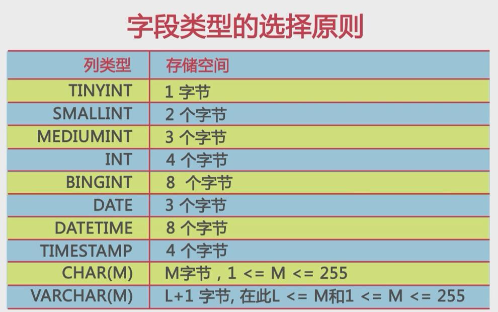

# 数据库设计
> 把数据库程序设计看做是在建立一座大厦。
>
> 在建立这座大厦进行建设之前，首先需要对大厦的整体结构进行设计，其次需要绘制成图纸，最后依据图纸进行施工。
>
> 简单来说，数据库设计是根据业务系统的具体需求，结合我们所选的数据库管理系统（DBMS），为这个业务系统构造出最优的数据存储模型。并建立好数据库中的表结构及表与表之间的关联关系的过程。使之能**有效**的对应应用系统中的数据进行**存储**，并可以**高效**的对已经存储的数据进行**访问**。
>
> 目前常用的关系型数据库系统有MySQL/Oracle/SQLServer/PgSql等；NoSQL系统：Mongo/Memcache/Redis。

## （一）数据库设计简介

> 需求分析-->逻辑设计-->物理设计-->维护优化
>
> 1、需求分析
>
> （1）数据是什么
>
> （2）数据有哪些属性
>
> （3）数据和属性各自的特点有哪些
>
> 2、逻辑设计
>
> 使用ER图对数据库进行逻辑建模
>
> 3、物理设计
>
> 根据数据库自身的特点把逻辑设计转换为物理设计
>
> 4、维护和优化
>
> （1）新的需求进行建表
>
> （2）索引优化
>
> （3）大表拆分
>
> **注**：经常存在这样一种情况：在项目刚建立的时候，数据库设计是非常完美的。随着应用上线时间越来越久，需求越来越多，数据库结构越来越复杂。
>
> **启示**：每次添加新的需求的时候，也要进行需求分析、逻辑设计、物理设计，完成之后再进行建表操作。

## （二）需求分析

### 1、需要做什么工作

> 1、了解系统中所要存储的数据
>
> 2、了解数据的存储特点
>
> ​	例如有的数据是有时效性的，可以采用过期、清理、孤岛的方式进行存储。
>
> ​	例如有的数据增长很快、数据量很大，但这些数据并不是核心数据，可以采用分库分表的方式进行存储。
>
> 3、了解数据的生命周期
>
> ​	在数据库设计的过程中我们经常会遇到，软件开发人员希望将日志信息存入数据库。这时我们一定要提前约定好归档清理规则，如果当这个表增长到非常大的时候再进行清理将会非常复杂。

### 2、要搞清楚的一些问题

> 1、实体及实体之间的关系（1对1，一对多，多对多）
>
> 2、实体所包含的属性有什么？
>
> 3、那些属性或属性的组合可以唯一标识一个实体

### 3、示例演示

> 以一个小型的电子商务网站为例，在这个电子商务网站的系统中包括了几个核心模块：**用户模块**，**商品模块**，**订单模块**，**购物车模块**，**供应商模块**。

**示例演示--用户模块**

> 用于记录注册用户信息
>
> **包括属性**：用户名、密码、电话、邮箱、身份证号、地址、名称、昵称.....
>
> **可选唯一标识属性**：用户名、身份证、电话
>
> **存储特点**：随系统上线时间逐渐增加，需要永久存储

**示例演示--商品模块**

> 用于记录网站中所销售的商品信息
>
> **包括属性**：商品编码、商品名称、商品描述、商品品类、供应商名称、重量、有效期、价格......
>
> **可选唯一标识属性**:（商品名称，供应商名称）、（商品编码）
>
> **存储特点**：对于线下商品科技归档存储

**示例演示--订单模块**

> 用于用户订购商品的信息
>
> **包括属性**：订单号、用户姓名、用户电话、收货地址、商品编号、商品名称、数量、价格、订单状态、支付状态、订单类型......
>
> **可选唯一标识属性**:（订单号）
>
> **存储特点**：永久存储（分表、分库存储）

**示例演示--购物车模块**

> 用于保存用户购物时选对的商品
>
> **包括属性**：用户名、商品编号、商品名称、商品价格、商品描述、商品分类、加入时间、商品数量......
>
> **可选唯一标识属性**:（用户名、商品编号、加入时间）、（购物车编号）
>
> **存储特点**：不用永久存储（设置归档、清理规则）

**示例演示--供应商模块**

> 用于保存所销售商品的供应商信息
>
> **包括属性**：供应商编号、供应商名称、联系人、电话、营业执照号、地址、法人......
>
> **可选唯一标识属性**:（供应商编号）,（营业执照号）
>
> **存储特点**：永久存储

**示例演示--模块与模块之间的关系**

## （三）逻辑设计

### 1、需要做什么工作

> 1. 将需求转换为数据库的逻辑模型
> 2. 通过ER图的形式对逻辑模型进行展示
> 3. 同所选用的具体的DBMS系统无关

### 2、ER图

**名词解释**

> **关系**：一个关系对应通常所说的一张表。
>
> **元组**：表中的一行即为一个元组。
>
> **属性**：表中的一列即为一个属性；每一个属性都有一个名称，称为属性名。
>
> **候选码**：表中的某个属性组，它可以唯一确定一个元组。
>
> **主码**：一个关系由多个候选码，选定其中一个为主码。
>
> **域**：属性的取值范围。
>
> **分量**：元组中的一个属性值。

**ER图例说明**

**ER图实例演示**

### 3、设计范式

> 由于在逻辑设计中，我们对同一个实体的存储方式可以有多重不同的设计。所以需要一些数据库设计的范式来帮助我们进行选择。
>
> 数据库设计范式实际上是数据库设计规范，符合数据库设计范式的设计，就是一种**简洁高效**的数据库设计。同时可以避免数据库的插入、更新、删除异常，最大限度的避免数据库的冗余。

**数据库范式**

> 常见的数据库设计范式包括：
>
> 第一范式，第二范式，第三范式以及BC范式。
>
> 当然还有第四及第五范式，不过这里我们会把重点放到前三个范式上，也是目前我们大多数数据库设计所要遵循的范式。

**数据操作异常及数据冗余**

> 插入异常：如果某实体随着另一个实体的存证而存在，即缺少讴歌实体时无法表示这个实体，那么这个表就存在插入异常。
>
> 更新异常：如果更改表所对应的某个实体实例的单独属性时，需要将多行更新，那么就说这个表存在更新异常。
>
> 删除异常：如果删除表的某一行来反应某实体实例。失效时导致另一个不同实体实例信息丢失，那么这个表中就存在删除异常。
>
> 数据冗余：是指相同的数据在多个地方存在，或者说表中的某个列可以由其他列计算得到，这样就说表中存在着数据冗余

**第一范式（1NF）**

> 定义：数据库表中的所有字段都是单一属性，不可再分的。
>
> 这一个单一属性是由基本的数据类型所构成的，如整数，浮点数，字符串，等；
>
> 换句话说：**第一范式要求数据库中的表都是二维表**。

**第二范式（2NF）**

> 定义：数据库的表中不存在非关键字段对任一候选字段的**部分函数依赖**。
>
> 部分函数依赖是指存在着注册关键字中的某一关键字决定非关键字的情况。
>
> 换句话说：**所有单关键字段的表都符合每二范式**

> 由于供应商和商品之间是多对多的关系，所以只有使用商品名称和供应商名称才可以唯一标识出一件商品。
>
> 也就是商品名称和供应商名称是一组组合关键字。
>
> 上表中存在以下的**部分函数依赖关系**，（商品名称）-->（价格，描述，重量，商品有效期），（供应商名称）-->（供应商电话）
>
> **存在问题：**1.插入异常；2.删除异常；3.更新异常；4.数据冗余。

**第三范式（3NF）**

> **定义**：第三范式是在第二范式的基础之上定义的，如果数据表中不存在非关键字段，对任意候选字段的**传递函数依赖**符合第三范式。

> **存在以下传递函数依赖关系：**
>
> （商品名称）-->(分类)-->(分类描述)
>
> 也就是说存在非关键字段“分类描述”，对关键字段“商品名称”的传递函数依赖。
>
> **存在问题：**
>
> （分类，分类描述）对于每一个商品都会进行记录，所以存在着数据冗余。同时存在数据的插入、更新及删除异常。

**BC范式（BCNF）**

> 定义：
>
> 在第三范式的基础之上，数据库表中如果不存在**任何字段**对**任一候选关键字段**的**传递函数依赖**则符合BC范式。
>
> 也就是说如果是符合关键字，则符合关键字之间也不能存在函数依赖关系。
>
> （以商品同供应商的关系表来说明BCNF）

> 假定：
>
> 供应商联系人只能受雇于一家供应商，每家供应商可以供应多个商品，则存在如下决定关系：
>
> （供应商，商品ID）->（联系人，商品数量）
>
> （联系人，商品ID）->（供应商，商品数量）
>
> 存在下列关系因此不符合BCNF要求：
>
> （供应商）->（供应商联系人）
>
> （供应商联系人）->（供应商）
>
> 并且存在数据材质异常及数据冗余。

## （四）物理设计

> 1、选择合适的数据库管理系统。
>
> Oracle、SQLServer、MySQL及PgSQL
>
> 2、定义数据库、表及字段的命名规范。
>
> 3、根据所选的DBMS系统选择合适的字段类型。
>
> 4、反范式化设计。

### 1、数据库管理系统。

> 常见的DBMS系统。
>
> Oracle和SQLServer==>商业数据库。
>
> MySQL和PgSQL==>开源数据库。
>
> **成本**
>
> 商业数据库要考虑版权费用，开源数据库并不需要。
>
> **功能上**
>
> Oracle事务成本非常低，SQLServer、MySQL和PgSQL事务成本非常高。
>
> **操作系统**
>
> SQLServer主要运行在Windows下。
>
> **开发语言**
>
> .NET ==> SQLServer
>
> **应用**
>
> 商业数据库更适合企业级项目。
>
> 开源数据库更适用与互联网项目。

### 2、常用的存储引擎

### 3、表及字段的命名规则

>所有对象命名应该遵循**下述原则**：
>
>1、可读性原则
>
>使用大写和小写来格式化的库对象名字以获得良好的可读性。
>
>例如：使用CustAddress而不是custaddress来提高可读性。（这里要注意有些DBMS系统对表名的大小写是敏感的）
>
>2、表意性原则
>
>对象的名字应该能够描述它所标识的对象。
>
>例如，对于表，表的名称应该能够体现表中存储的数据内容；对于存储过程，存储过程门窗应该能够体现存储过程的功能。
>
>3、长名原则
>
>尽肯能少使用或者不使用缩写，适用于数据库（DATABASE）名之外的任一对象。

### 4、数据库字段类型的选择原则

> 列的数据类型一方面影响数据存储空间的开销，另一方面也会影响数据查询性能。
>
> 当一个列可以选择多种数据类型时，应该优先考虑数字类型，其次是日期或二进制类型，最后是字符串类型。
>
> 对于相同级别的数据类型，应该优先选择占用空间小的数据类型。

> **以上选择原则主要是从下面两个角度考虑**：
>
> 1. 在对数据进行比较（查询条件、JOIN条件及排序）操作时：**同样的数据，字符处理往往比数字处理慢**。
> 2. 在数据库中，数据处理以页为单位，**列的长度约小，利于性能提升**。

### 5、数据库如何具体选字段类型

**char与varchar如何选择**

> 原则：
>
> 1. 如果列中存储的数据长度差不多是一致的，则应该考虑用char，否则应该考虑用varchar。
> 2. 如果列中的最大数据长度小于50Byte，则一般也考虑用char。（当然，如果这个列很少用，则基于节省空间和减少I/O的考虑，还是可以选用varchar）
> 3. 一般不建议定义大于50Byte的char类型列。

**decimal与float如何选择**

> 原则：
>
> 1. decimal用于存储精确数据，而float智能用于存储非精确数据。故精确数据只能选择用decimal类型。
> 2. 由于float的存储空间开销一般比decimal小（精确到7位小数只需要4个字节，而精确到15位小数只需要8字节），故非精确数据优先选择float类型。

**时间类型如何存储**

> 1. 使用int来存储时间字段的优缺点
>
> **优点**：字段长度比datetime小。
>
> **缺点**：使用不方便，要进行函数转换。
>
> **限制**：只能存储到2038-1-19 11:14:07即2的32次方。
>
> 2. 需要存储的时间粒度
>
> **年 月 日 小时 分 秒 周**

### 6、数据库设计其他注意事项

**如何选择主键**

> **1、区分业务主键和数据库主键**
>
> 业务主键用于标识业务数据，进行表与表之间的关联；
>
> 数据库主键为了优化数据存储（Innodb会生成6个字节的隐含主键）
>
> **最好人为的定义一个主键，而不是使用隐含主键**
>
> **2、跟据数据库的类型，考虑主键是否要顺序增长**
>
> 有些数据库是按主键的顺序存储的。**数据的逻辑迁移。**
>
> **3、主键的字段类型所占空间要尽可能小**
>
> 对于使用聚集索引方式存储的表，每个索引后都会附加主键信息。

**如何选择外键**

> 1. 降低数据导入的效率
> 2. 增加维护成本
> 3. 虽然不建议使用外键约束，但是相关链的列上一定要建立索引

**避免使用触发器**

> 1. 降低数据导入的效率。
> 2. 可能会出现意想不到的数据异常。
> 3. 使业务逻辑变的复杂。

**关于预留字段**

> 1. 无法准确的知道预留字段的类型。
> 2. 无法准确的知道预留字段中所存储的内容。
> 3. 后期维护预留字段所要的成本，同增加一个字段所需要的成本是相同的。
> 4. 严禁使用预留字段。

### 7、反范式化

> **反范式化**时针对范式化而言的，在前面介绍了数据库设计的第三范式，所谓的反范式化就是为了**性能**和**读取效率**的考虑而适当的对第三范式的要求进行违反，而允许存在少量的数据冗余，换句话来说**反范式化就是使用空间来换取时间**。

**什么是反范式化**

**在写的时候占用更多空间，大大提高读取的效率。**

**为什么反范式化**

> 1. 减少表的关联数量。
> 2. 增加数据的读取效率。
> 3. 反范式化一定要适度。

## （五）维护优化

**维护和优化中要做什么**

> 1. 维护数据字典
> 2. 维护索引
> 3. 维护表结构
> 4. 在适当的时候对表进行水平拆分或垂直拆分

**如何维护数据字典**

> 1. 使用第三方工具对数据字典进行维护
>
> 2. 利用数据库本身的备注字段来维护数据字典。以MySQL为例
>
> CREATE TABLE CUSTOMER(
>
>    ......
>
> ) COMMENT ‘客户表’
>
> 3. 导出数据字典
>
> 关联查询，修改数据字典时，只修改备注字段。

**如何维护索引**

> **如何选择合适的列建立索引？**
>
> 1.出现在WHERE从句；GROUP BY从句；ORDER BY从句中的列。
>
> 2.可选择性高的列要放到索引的前面。（SQL优化器从新编译，排序和优化）
>
> 3.索引中不要包括太长的数据类型。（md5信息查找）
>
> **注意事项：**
>
> 1.索引并不是越多越好，过多的索引不但会降低写的效率，而且会降低读的效率。
>
> 2.定期维护索引碎片。
>
> 3.在SQL语句中不要使用强制索引关键字。由于数据量的增加，原来的索引可能就不太合适。使用强制关键字，在索引更新时，如果开发人员不清楚，容易出错。

**如何维护表结构**

> 注意事项
>
> 1.使用在线变更表结构的工具
>
> MySQL5.5之前可以使用pt-online-schema-change
>
> MySQL5.6之后本身支持在线表结构的变更
>
> 2.同时对数据字典进行维护
>
> 3.控制表的宽度和大小

**数据库中适合的操作**

> 1.**批量操作** VS 逐条操作
>
> 2.禁止使用Select * 这样的查询（IO浪费/表结构变更，程序容易出错）
>
> 3.控制使用用户自定义函数（大量使用自定义函数，会导致索引出错）
>
> 4.不要使用数据中的全文索引（可以使用专业的工具）

**表的垂直拆分**

> **为了控制表的宽度可以进行表的垂直拆分。**
>
> 1. 经常一起查询的列放到一起。
> 2. text、blob等大字段拆分出到附加表中

> **为了控制表的大小可以进行表的水平拆分。**
>
> 1.通过主键HASH的方式来进行水平拆分。

# 我的数据库设计

## （一）需求分析

### 1、系统中所要存储的数据

> 1、用户端，秘钥管理（秘钥名称、公钥、私钥）
>
> 2、服务器端，用户管理模块，版权管理模块。

**1、用户**

> 用于记录用户信息
>
> **包括属性**：邮箱、密码、角色
>
> **可选唯一标识属性**:（邮箱）
>
> **存储特点**：随系统上线时间逐渐增加，需要永久存储

**2、身份**

> 用于记录用户的实名认证信息
>
> **包括属性**：姓名、电话、身份证号、地址
>
> **可选唯一标识属性**:（身份证号）、（电话）
>
> **存储特点**：随系统上线时间逐渐增加，需要永久存储

**3、公钥**

> 用于记录用户所持有的公钥
>
> **包括属性**：公钥
>
> **可选唯一标识属性**:（公钥）
>
> **存储特点**：用户会对公钥进行更新，随系统上线时间逐渐增加，需要永久存储

**4、版权**

> 用于记录版权信息
>
> **包括属性**：作品编号、作品名称、作品描述、登记时间、IPFS存储地址、区块链交易ID
>
> **可选唯一标识属性**:（作品编号）
>
> **存储特点**：随系统上线时间逐渐增加，需要永久存储

| 字段名称            | 数据类型 | 长度 | 是否允许为空 | 是否为主键 | 字段说明   |
| ------------------- | -------- | ---- | ------------ | ---------- | ---------- |
| userInfoEmail       | char     | 32   | 否           | 是         | 用户邮箱   |
| userInfoPhoneNumber | char     | 11   | 是           | 是         | 用户手机号 |
| userInfoIdCard      | char     |      |              |            |            |
|                     |          |      |              |            |            |
|                     |          |      |              |            |            |
|                     |          |      |              |            |            |
| userInfoPassword    |          |      |              |            |            |

npx sequelize model:generate --name Todo --attributes name:string,deadline:date,content:string

