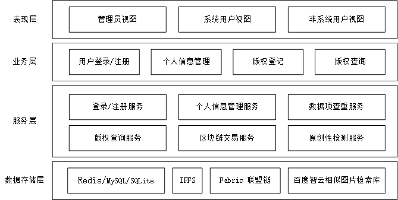
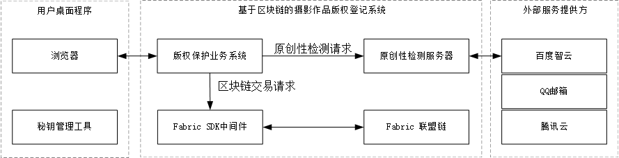
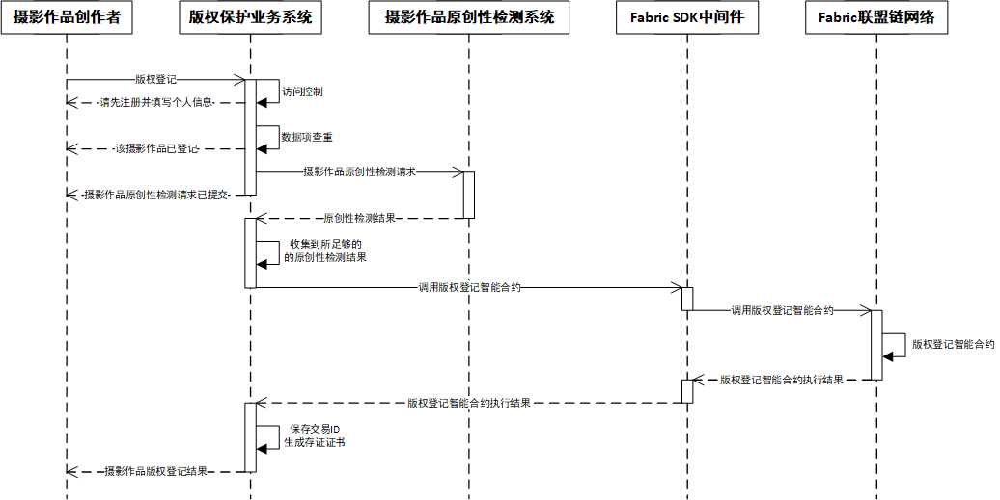

|项目名称|项目描述|项目特点|
|:----:|:----:|:----:|
| 基于区块链的摄影作品版权登记系统设计与实现 |基于联盟链及相关技术进行摄影作品版权保护|1.多中心联合原创性检测 2.原创性检测内容全面|

# （一）系统架构
## （1）系统架构设计

- 表现层
  表现层负责为用户提供交互工具，包括管理员视图、系统用户视图和非系统用户视图。
- 业务层
  业务层负责处理特定业务，包括用户注册/登录、个人信息管理、版权登记和版权查询。
- 服务层
  服务层负责为业务层提供特定服务，包括登录/注册服务、用户信息管理服务、数据项查重服务、版权查询服务、区块链交易服务和原创性检测服务。需要特别注意的是：(1)为将区块链与业务系统分离，降低区块链业务的接入难度，区块链交易服务由Fabric SDK中间件提供。（2）为解决现有区块链版权保护系统原创性检测中心化和原创性检测不全面的问题，原创性检测服务由原创性检测服务器提供。
- 数据存储层
  数据存储层负责数据存储，包括Redis、MySQL、SQLite、Fabric联盟链和百度智云相似图片检索库。其中，Redis为高速缓存，负责缓存版权信息；MySQL为大型结构化数据库，负责存储用户信息和版权信息；SQLite为小型结构化数据库，负责存储用户秘钥；IPFS为不可篡改的网络数据库，负责存储系统用户公钥加密后的摄影作品，用于摄影作品的永久存储；Fabric联盟链是多方维护、交叉验证、全网一致、不可篡改的网络数据库，用于多版权机构对摄影作品的联合原创性检测和版权信息的永久存储；百度智云相似图片检索库为图片特征大规模数据检索库，负责存放爬虫爬取的全网摄影作品数据，用于判断摄影作品是否存在抄袭行为。

## （2）功能模块设计

基于区块链的摄影作品版权登记系统，分为秘钥管理工具、版权保护业务系统、原创性检测服务器、Fabric SDK中间件以及Fabric联盟链等多个子系统。其中，秘钥管理工具为客户端桌面应用，主要负责秘钥管理；版权保护业务系统为Web服务器，主要负责提供摄影作品版权登记和版权查询服务；原创性检测服务器主要负责提供摄影作品原创性检测服务；Fabric SDK中间件主要负责提供区块链交易服务。

## （3）系统交互示意图

## （4）部署架构

## （5）摄影作品版权登记序列图

# （二）系统角色与功能

|系统角色|角色描述|
|:----:|:----:|
|管理员|系统管理员，维持系统稳定|
|系统用户|已注册的摄影作品创作者|
|非系统用户|未注册的摄影作品创作者|

|管理员功能|功能描述|
|:----:|:----:|
|用户登录|通过账号密码登录管理系统|
|管理用户|查看用户、添加用户、删除用户|
|监控系统状态|进程状态、系统状态、统计信息|
|管理系统日志|日志查看、日志下载、日志删除|
|更新系统配置|配置文件更新|

|系统用户功能|功能描述|
|:----:|:----:|
|用户登录|通过账号密码登录系统|
|用户信息管理|添加、删除个人信息|
|摄影作品版权登记|填写表单进行摄影作品版权确权|
|摄影作品版权查看|填写表单查询版权信息|

| 非系统用户功能 |                 功能描述                 |
| :------------: | :--------------------------------------: |
|    用户注册    | 通过填写邮箱和密码进行注册，称为系统用户 |
|    版权查询    |  通过交易ID或摄影作品Hash值查询版权信息  |

# （三）前端界面

# （四）后端接口

# （五）后端数据库设计
